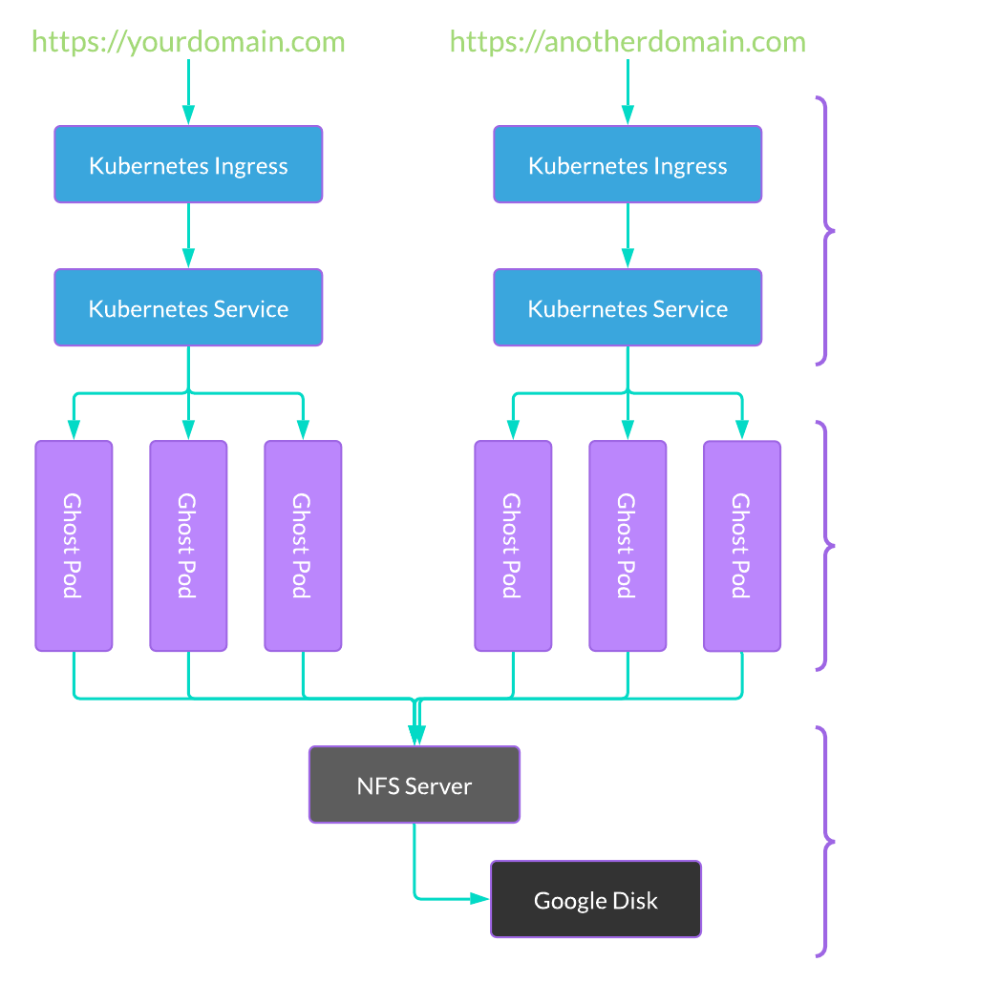

# Ghost blog on kubernetes



This terraform module will deploy [ghost](https://ghost.org) blog on kubernetes through terraform.

The following resources will be created:

* Deployment
* Service
* Ingress

# Example

The following will create two deployments for each site listed in the sites list:

### locals.tf

```hcl
locals {

    sites = [

        {

            name      = "matthewdavis.io"
            hostnames = [ "matthewdavis.io" ]

        }, {

            name      = "garagefarm-ai"
            hostnames = [ "garagefarm.ai" ]

        }

    ]

}
```

### providers.tf

Tell terraform what providers to pull in so we can use them to create resources:

```hcl
provider "google" {

    project     = "changeme"
    region      = "us-east4"
    credentials = "/path/to/gcp/service-account-key.json"

}

provider "kubernetes" {

    config_path    = "~/.kube/config"
    config_context = "name-of-your-cluster-context"
    host           = data.google_container_cluster.cluster.endpoint
    insecure       = true

}
```

### data.tf

Get the clusters API endpoint (remove this if you just want to hardcode it above --^):

```hcl
data "google_container_cluster" "cluster" {

    name     = "name-of-your-cluster"
    location = "us-east4-a"

}
```

### main.tf

The terraform magic:

```hcl 
module "site" {

    count = length(local.sites)

    name              = local.sites[ count.index ].name
    namespace         = "default"
    
    hostnames         = local.sites[ count.index ].hostnames
    
    database_host     = "changeme"
    database_username = "changeme"
    database_password = "changeme"
    database_name     = replace(local.sites[ count.index ].name, "-", "_")
    
    request_cpu       = "250m"
    request_memory    = "200Mi"
    limit_cpu         = "500m"
    limit_memory      = "250Mi"
    
    replicas          = 50
    
    #
    # Force pods to only run on the nodes that has the label
    # "role" and the value "services" (optional).
    #
    node_selector = {

        role = "services"

    }

}
```
